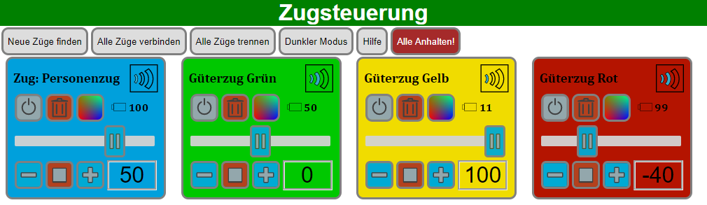

# ZugsteuerungFrontend

Mit der Zugsteuerung lassen sich Lego Züge die das Powered Up System benutzen steuern.
Die Zugsteuerung besteht aus 2 Teilen:
- Ein Server der sich über Bluetooth mit dem Zug verbindet und eine API zur Steuerung bereitstellt.
- Ein Webinterface über das der Server gesteuert werden kann.

Dieses Projekt enthält das Webinterface (Frontend) für die Zugsteuerung.
Das Webinterface besteht aus einer einzelnen Website die mit Angular 7 erstellt wurde.
Die Serveranwendung befindet sich [hier](https://github.com/JK-Delta/Zugsteuerung) und sollte zuerst installiert
werden.

## Übersicht



## Installation

In dieser Anleitung wird beschrieben, welche Terminalbefehle notwendig sind um das Webinterface zu installieren.
Öffne also zuerst ein Terminalfenster oder verbinde dich von einem anderen Computer über SSH.
Falls noch kein Webserver auf deinem System installiert ist, kannst du den Webserver *lighttpd* mit folgendem
Befehl installieren:
```
sudo apt-get install lighttpd
```
Lade nun die neuste Release Version herunter:
```
wget https://github.com/JK-Delta/ZugsteuerungFrontend/releases/download/1.0.0/ZugsteuerungFrontend.zip
```
Danach das Archiv entpacken:
```
unzip ZugsteuerungFrontend.zip
```
Der Inhalt des Archivs muss nun in das Verzeichnis des Webservers kopiert werden:
```
sudo cp -r ZugsteuerungFrontend/* /var/www/html/
```
Wenn du einen anderen Webserver benutzt, kann das Verzeichnis anders lauten.
Das Webinterface ist nun fertig installiert. Der Webserver *lighttpd* started automatisch mit dem System
zusammen, das Webinterface muss also nicht extra gestartet werden.

## Benutzung

Stelle zunächst sich das die Serveranwendung installiert und gestartet ist.

Navigiere in deinem Browserfenster zur Adresse des Systems.
Bei einem Raspberry Pi im lokalen Netzwerk funktioniert normalerweise die Adresse:
```
raspberrypi.local
```
Eventuell muss du aber die IP-Adresse manuell herausfinden.
Da zu Beginn noch keine Züge im System sind, wird auf der Website die Hilfe automatisch eingeblendet.
Folge der Anleitung auf der Website um den ersten Zug hinzuzufügen und zu steuern.

Falls die Website leer bleibt, prüfe ob Javascript im Browser aktiviert ist.

## Lizenz
Dieses Projekt steht unter der [MIT](https://spdx.org/licenses/MIT.html)-Lizenz zur Verfügung.
